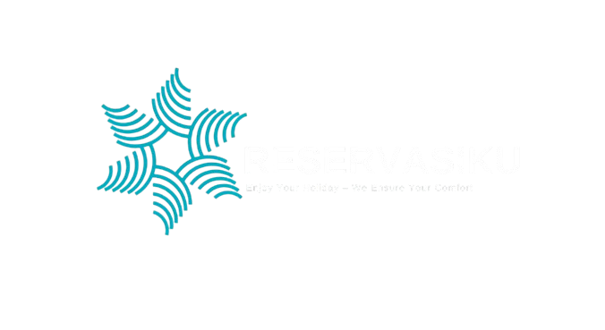
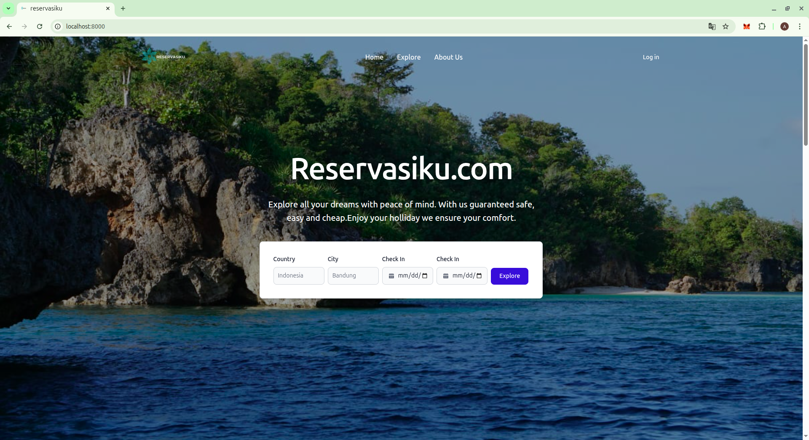
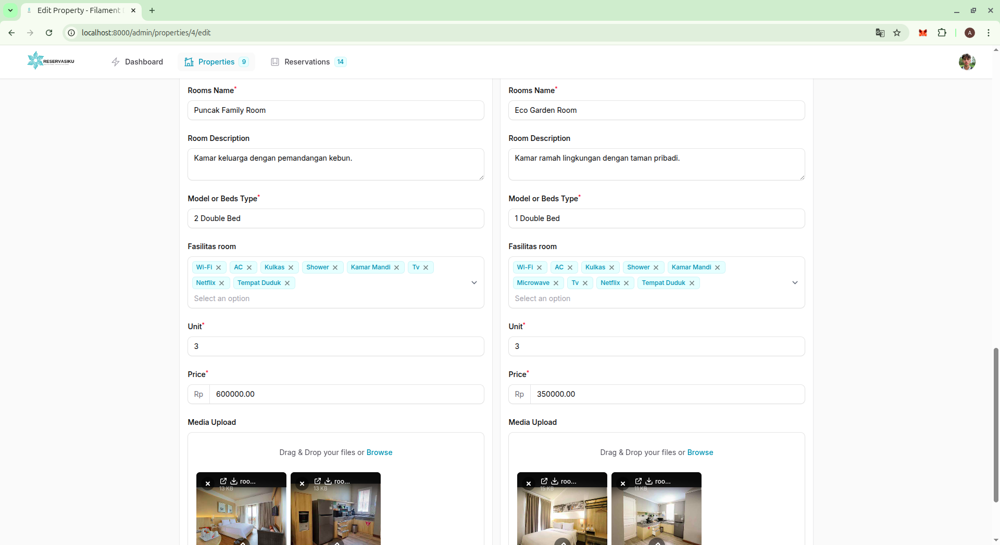

# About Reservasiku

My reservation web application is an online reservation web. This web consists of two main parts, namely the business part and the part where in this part a businessman or property owner can add the property he owns and start his business, and the user part where in this part the user can search and rent the place he likes easily, which is combined into one complete web unit. making this web application a multi-role web application whose code is centralized, structured, and easy to manage.

# Contributor

- **[Afdan Rivaldi](https://github.com/Afdan678)** : Tech Researcher & Lead Academic Writer
- **[Alvin Nugraha Saputra](mailto:alvinoegraha@gmail.com)** : UI/UX Design Resea
- **[Aji Setiawan](https://github.com/ajiistwn)** : Tech Lead & Fullstack Developer
- **[Akbar Fazar Fadililah](https://github.com/fazar212)** : Web Developer
Developer
- **[Sauqi Zamani](https://)** : Academic Writer
- **[Axel Elyas Ginting](https://)** : Academic Writer

We greatly appreciate and respect anyone who contributes to this project. Both for written and unwritten names.

# Technology
- **[Laravel](https://laravel.com).**
- **[Filament](https://filamentphp.com).**
- **[MySQL](https://www.mysql.com)** & **[PhpMyAdmin](https://www.phpmyadmin.net).**
- **[Tailwind](https://tailwindcss.com)** with **[Flowbite](https://flowbite.com)**.
- **Javascript** & **[Jquery](https://jquery.com).** 
- **[Midtrans](https://midtrans.com/id).**

The technology we use is modern technology to support impressive speed, convenience and interactivity.

# Feature
As we have mentioned, we have two parts in this web app, namely the user part and the business part.

## Reservasiku User
This is the user page. where the user is provided with a registration page and can then edit the profile as well as the search page and also the reservation page.

### Landing Page
In the user section we have the main section, namely the landing page.
#### Home

On the landing page, specifically in the home section, there is a welcoming word and a search form to find a place with the desired time.

#### Explore

This is the explore page, here a list of available properties will appear which can be selected according to your wishes.

#### About

There is also an about section here which explains a little about us.

### User Authentication
Of course we provide authentication features such as login register and edit profile features. We also provide payment history records.

#### Login

This is the login page. You can login to your account with the email and password that has been registered here.

#### Register

If you don't have an account yet, you can register on the registration page that we provide.

#### Profile

If you are already logged in, the login navigation will be replaced with your name and if you click on it, it will take you to your profile page.

#### Paymet History

On our profile page, we also provide a list of your transactions or payment history. If you close your payment window during a transaction, you can pay it here.

#### Edit Profile

We also provide features to edit your data.

### Reservation
The reservation feature is on the detail page of the property selected from the explore landing page. On this page you can choose the room you want, determine the date and make the payment.

#### Detail Property

Property details contain property information, such as name, address, facilities, and pictures.

#### Room List

The room list is part of the property details containing information about available rooms and their prices. There is also a select button here to make a reservation.

#### Pup-up Reservation

When you choose a room, a pop-up will appear containing brief information about the room you chose and a form for selecting the reservation date.

#### Pop-up Payment

After selecting the date on the reservation form, a payment popup will appear from Midtrans to make the payment.

## Reservasiku Business
Different from the user section, this business section is where business people put their property and rent out the place to make a profit.

### Business Authentication
Of course we provide authentication features such as login register and edit profile features. We also provide payment history records.

#### Login

This is the login page. You can login to your account with the email and password that has been registered here.

#### Register

If you don't have an account yet, you can register on the registration page that we provide.

#### Profile

On this profile page we can directly edit the data we want.

### Dashboard

This business landing page is a dashboard page that contains charting of some of the data you have, such as data on the number of properties, rooms, reservation graphs, and dominant assets you have.

### Properties

This is the property page, which contains data on the property you own.

#### List Properties

This is the main page of the property feature, namely the page that displays the list of properties owned.

#### Property Detail & Rooms

If we look at the details of the property, we will be directed to the edit profile form, where we can directly see and edit the property data that we want to edit. On the property details page, room data will also appear which we can edit directly.

#### Create Property & Room

Here we can add property and room data that we have simultaneously with the repeat flow.

### Reservation

This page is a page that displays reservation data generated by your property assets.

#### History Reservation

The reservations page is reservation history data along with the status and nominal payment. Contains a static display that cannot be edited because it contains transaction results managed by the program.

## License

Reservasiku repository licensed under the [Creative Commons Attribution-NonCommercial 4.0 International (CC BY-NC 4.0)](https://creativecommons.org/licenses/by-nc/4.0/).
